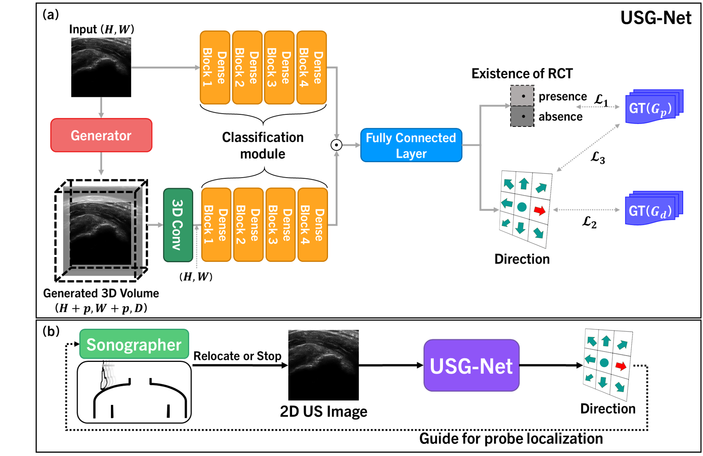
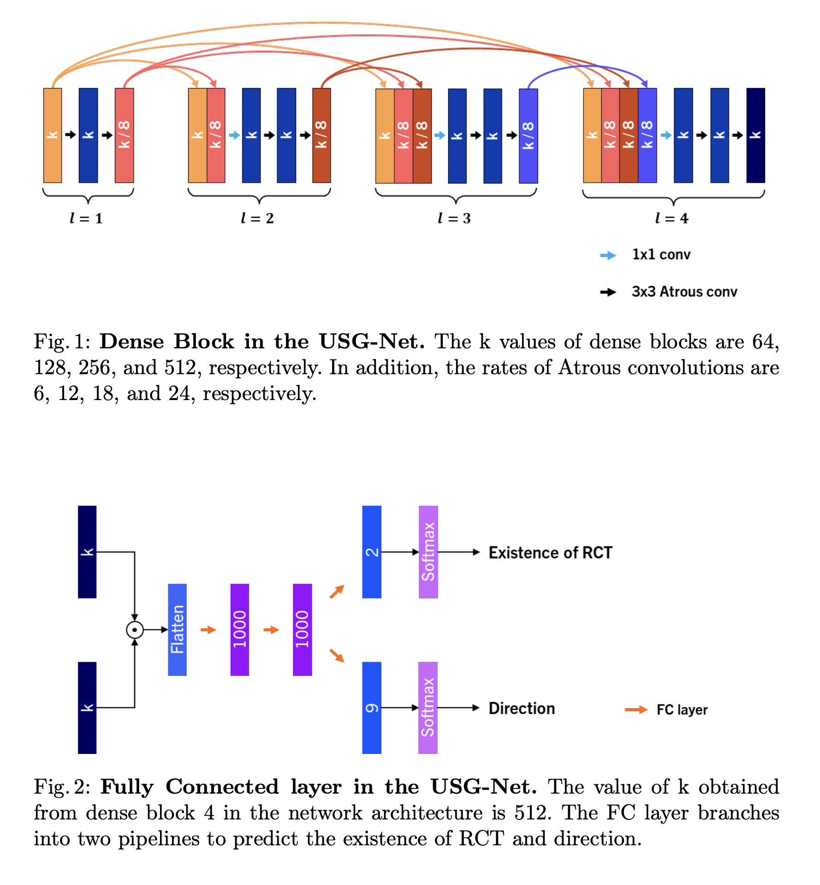
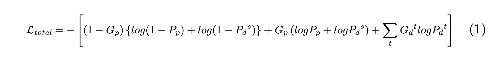
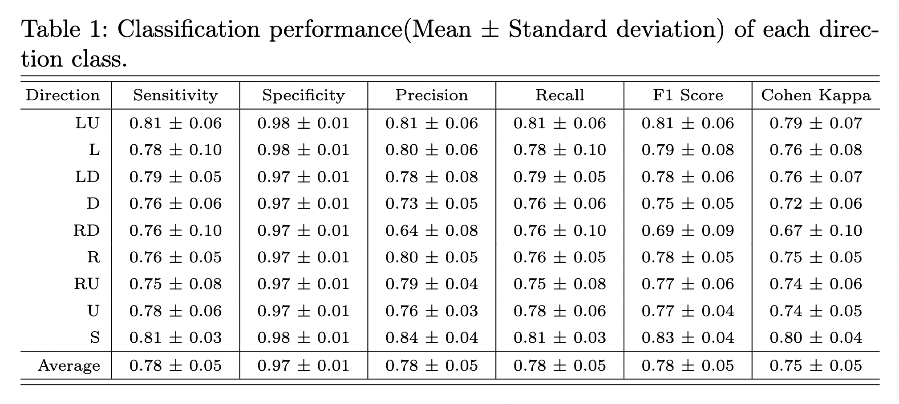
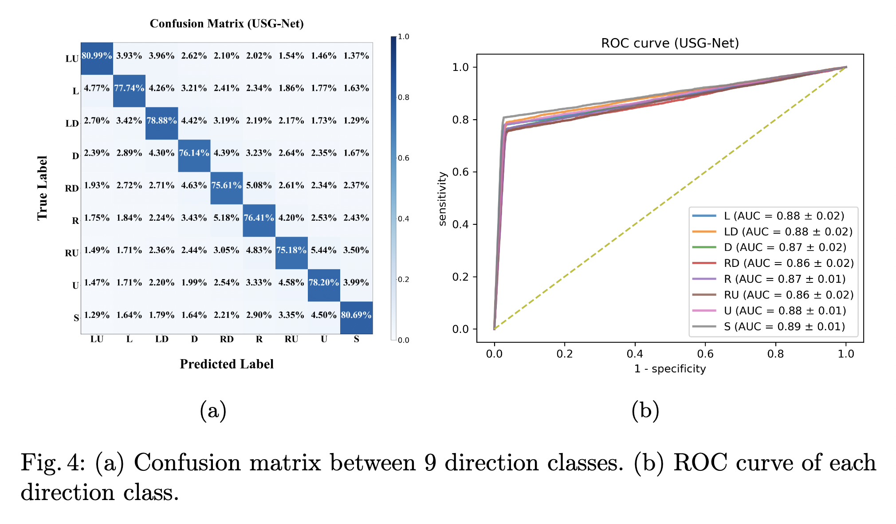

## Preparations
### Download Codes
    $ git clone https://github.com/kyungsu-lee-ksl/USG-Net.git
    $ cd USG-Net/
    $ sudo python -m pip install -r requirements.txt


### Pre-Trained Weights and Dataset

Due to intellectual property rights and privacy of medical data, please contact the author (ks_lee@dgist.ac.kr) for pre-trained weights, datasets, and codes for dataset generation.

<br>

<br>
<br>

## Ultrasound Scanning Guide Network (USG-Net)

### A. USG-Net
[[Code]](implementations/util/models.py)

<p align="center">
    
</p>

As shown in Figure 3(a), USG-Net classifies the existence of RCT and the direction of the probe movement from a 2D US image using the anatomical knowledge of a generated 3D volume image in the GAN-based pipeline. To match the dimensions between the 2D and 3D feature maps, a 3D convolutional layer was placed for the generated 3D volume image. The classification network consists of an atrous spatial pyramid pooling (ASPP) module for a large receptive field and dense connectivity to improve the feature blurring and vanishing gradient after repeated feed-forwarding. In addition, a fully connected (FC) layer receives features extracted from the 2D and predicted 3D images after concatenating them. Note that the output of the USG-Net has two pipelines: (1) binary classification of the existence of an RCT and (2) nine-categorical classification for probe movements. Hence, the penultimate FC layer branches as two pipelines, followed by softmax layers. Furthermore, after pre-training, USG-Net is trained without the discriminator because the GAN-based model consumes a significant amount of training time and requires a large memory allocation.

<p align="center">
    
</p>


##

### B. Loss functions
The loss functions for USG-Net were designed based on the cross-entropy in $L_1$ and $L_2$. Let $P_p$ and $G_p$ be the predicted existences of the RCT and the corresponding ground truth, respectively. Similarly, let $P_d$ and $G_d$ be the predicted directions of the probe movement and the corresponding ground truth, respectively. To train the USG-Net, cross-entropy losses are utilized in $L_1$ using $P_p$ and $G_p$, and $L_2$ using $P_d$ and $G_d$. Furthermore, the correlations ($L_3$) between $G_p$ and $P_d$ are constrained. When $G_p$ is 1 or 0, the probability of $P_d$ should be more or less dominant in $S$. Therefore, the knowledge obtained from the classification of the existence of RCT is transferred into another pipeline, such that it is utilized to determine the direction of the probe movement. In summary, the loss function $L_{total}$ for the network is as follows:

<p align="center">
    
</p>

##


<br>
<br>

## [PAPER] Boundary-Oriented Binary Building Segmentation Model with Two Scheme Learning for Aerial Images

#### Authors
Kyungsu Lee and Jaeseung Yang, Moonhwan Lee, Jin Ho Chang, Jun-Young Kim, and Jae Youn Hwang*

* Kyungsu Lee and Jaeseung Yang contributed equally.

#### Abstract
Ultrasound (US) imaging is widely used in the field of medicine. US images containing pathological information are essential for better diagnosis. However, it is challenging to obtain informative US images because of their anatomical complexity, which is significantly dependent on the expertise of the sonographer. Therefore, in this study, we propose a fully automatic scanning-guide algorithm that assists unskilled sonographers in acquiring informative US images by providing accurate directions of probe movement to search for target disease regions. The main contributions of this study are: (1) proposing a new scanning-guide task that searches for a rotator cuff tear (RCT) region using a deep learning-based algorithm, i.e., ultrasound scanning-guide network (USG-Net); (2) constructing a dataset to optimize the corresponding deep learning algorithm. Multidimensional US images collected from 80 patients with RCT were processed to optimize the scanning-guide algorithm which classified the existence of RCT. Furthermore, the algorithm provides accurate directions for the RCT, if it is not in the current frame. The experimental results demonstrate that the fully optimized scanning-guide algorithm offers accurate directions to localize a probe within target regions and helps to acquire informative US images.

#### Experimental Results

<p align="center">
    
</p>

Table 1 shows the measured evaluation scores for various metrics. The classification performance of the \textit{S} (stop) class tends to be higher than other direction classes. In addition, standard deviations are minimum between direction classes. The results demonstrate that the USG-Net can successfully predict the path and allow the sonographer to navigate an ultrasound probe toward the target region, thereby detecting RCT.


<p align="center">
    
</p>

Furthermore, to analyze the direction predicted by our USG-Net, a confusion matrix for each direction class is shown in Figure 4(a). Overall, our proposed network achieved an average classification accuracy of 77.86\% for the nine classes. Specifically, the classes with large errors were around the true positives that partially included the error directions, indicating that the predicted directions were not completely incorrect (e.g., predicted: R, ground truth: RD). Despite the strict classification criteria, Cohen’s kappa values were over 0.7, and the area under the curve (AUC) values were over 0.8 in all the classes, indicating the potential of our proposed network for use as an effective tool for practical diagnosis in clinics (Table 1, Figure 4(b)). Moreover, statistical verification of the Delong's test reported that the p-value was less than 0.01.


#### Conclusion

This study states the primary task of a scanning-guide algorithm, which is to search for target disease regions using a corresponding network. In this regard, we propose a deep learning-based USG-Net with an automatic dataset construction method based on 3D US images to facilitates the learning of 3D anatomical representations. To employ the 3D anatomical knowledge for the scanning-guide, USG-Net adopts a 3D generator prior to the classification module to predict the directions of the probe’s movement. Consequently, the generator significantly enhances its guidance capability. USG-Net achieved a guidance accuracy of 77.86%. The high evaluation performance demonstrates the effectiveness of the proposed network for this task, suggesting its potential as a novel tool for assisting sonographers in the diagnosis of various diseases using ultrasound imaging.


## Citation

If you find our work useful in your research, please consider citing our paper:

```
@inproceedings{lee2022usg,
  title={USG-Net: Deep Learning-based Ultrasound Scanning-Guide for an Orthopedic Sonographer},
  author={Lee, Kyungsu and Yang, Jaeseung and Lee, Moon Hwan and Chang, Jin Ho and Kim, Jun-Young and Hwang, Jae Youn},
  booktitle={International Conference on Medical Image Computing and Computer-Assisted Intervention},
  pages={23--32},
  year={2022},
  organization={Springer}
}
```
